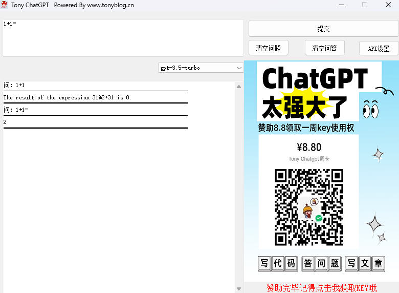

## Tony GPT

---
- 支持模型 gpt-3.5-turbo | gpt-3.5-turbo-0613 | gpt-3.5-turbo-16k | gpt-3.5-turbo-16k-0613| gpt-4 | gpt-4-0613
- 支持定时自定义API及KEY
- 仅支持window客户端

---
### 软件安装
**最新版本TonyGPT V1.0**

本软件无需安装，直接下载到本地运行即可。

---
### 关于

作者： Tony
博客： https://www.tonyblog.cn
公众号：

### 声明

- **本插件版权归[Tony Blog www.tonyblog.cn](https://www.tonyblog.cn "www.tonyblog.cn")所有；**
- **请勿抄袭传播并用作商业用途。**
- **请勿用于违法用途。**
- **因使用不当造成的后果与软件作者无关。**

---
### 赞赏与支持

